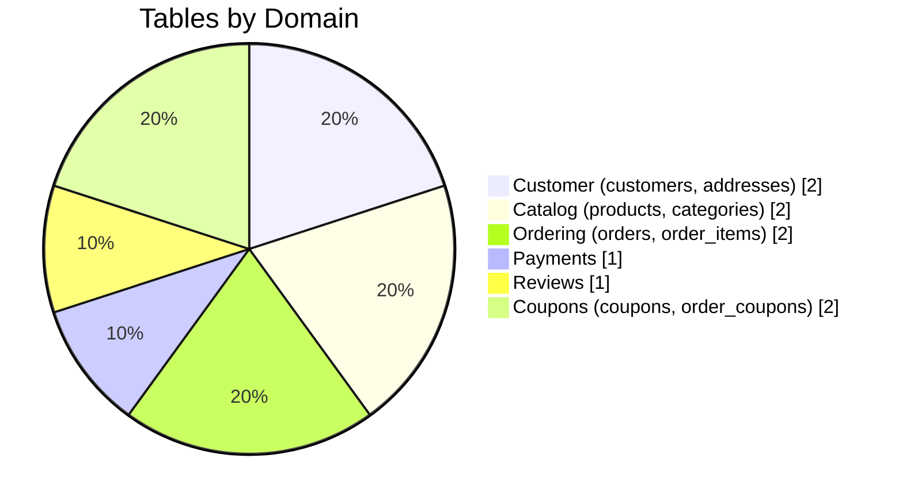
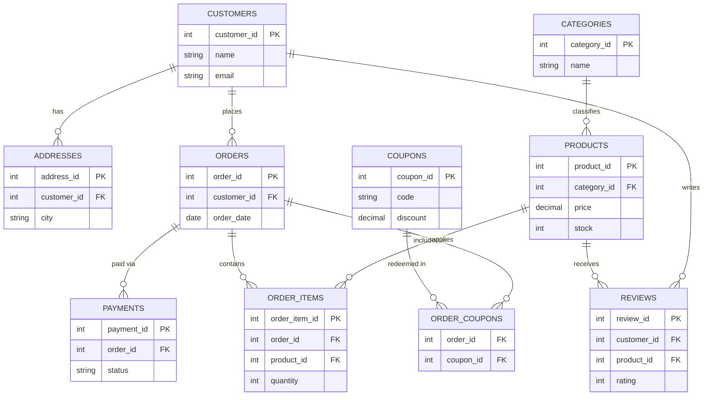
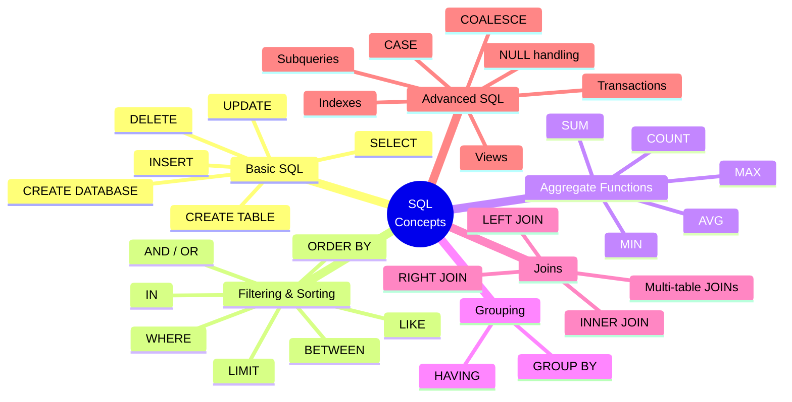
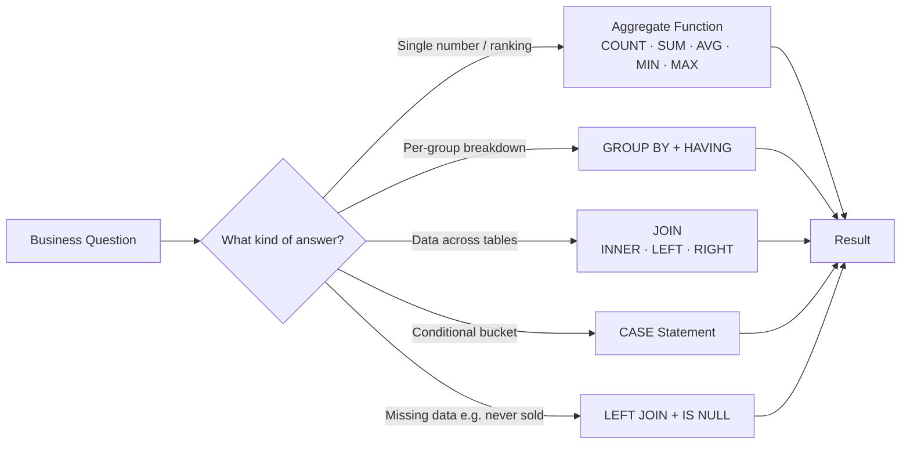
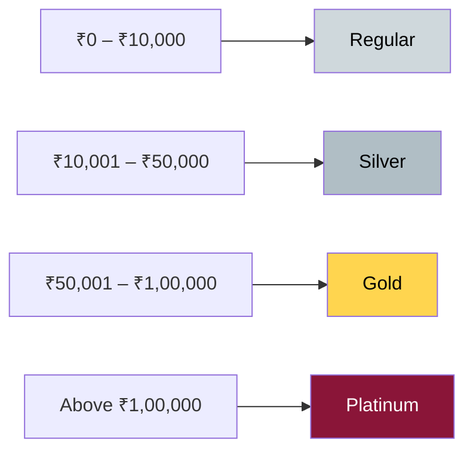
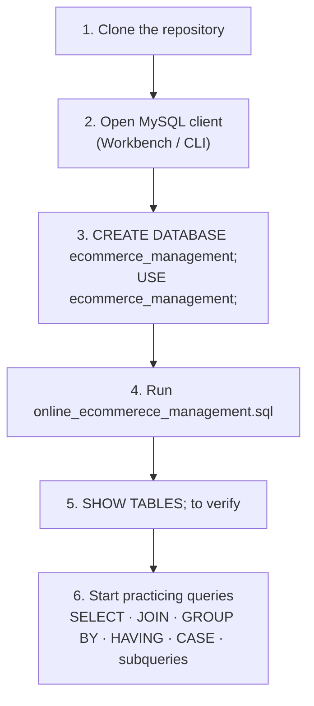
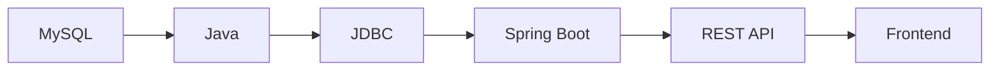
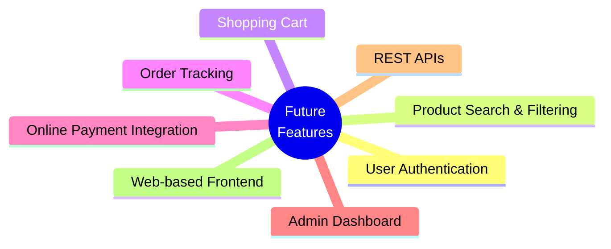

# 🛒 Online E-Commerce Management System

## 📌 Project Overview

The **Online E-Commerce Management System** is a relational database project built using **MySQL**. It is designed to manage the core operations of an online shopping platform, including customers, addresses, products, categories, orders, order items, payments, reviews, coupons, and discounts.

The project demonstrates practical SQL and relational database concepts such as **primary keys, foreign keys, joins, aggregate functions, GROUP BY, HAVING, subqueries, CASE statements, constraints, and transactions**.

---

## 🎯 Project Objectives

- Manage customer information and multiple customer addresses
- Organize products into categories
- Maintain product prices, stock, and seller information
- Manage customer orders and ordered products
- Track payments and payment status
- Store product reviews and ratings
- Manage discount coupons
- Generate useful business reports using SQL queries
- Practice relational database design and SQL problem solving

---

## 🗂️ Database Name

```sql
ecommerce_management
```

---

## 🏗️ Database Tables

The database contains the following 10 tables:

| Table | Purpose |
|---|---|
| `customers` | Stores customer details |
| `addresses` | Stores customer home/office addresses |
| `categories` | Stores product categories |
| `products` | Stores product information and inventory |
| `orders` | Stores customer orders |
| `order_items` | Stores products included in each order |
| `payments` | Stores payment information |
| `reviews` | Stores customer product reviews |
| `coupons` | Stores discount coupon details |
| `order_coupons` | Connects orders with applied coupons |



---

## 🔗 Database Relationships (ER Diagram)



---

## 🧠 SQL Concepts Practiced



---

## 📊 Example Business Queries

The project can answer questions such as:

| # | Business Question | SQL Concept Used |
|---|---|---|
| 1 | What are the 5 most expensive products? | ORDER BY + LIMIT |
| 2 | How many customers are registered? | COUNT() |
| 3 | How many products are available? | COUNT() |
| 4 | What is the average product price? | AVG() |
| 5 | What is the most expensive product? | MAX() / ORDER BY |
| 6 | What is the cheapest product? | MIN() / ORDER BY |
| 7 | What is the total value of current inventory? | SUM(price × stock) |
| 8 | What is the average price per category? | GROUP BY + AVG() |
| 9 | Which cities have more than 3 customers? | GROUP BY + HAVING |
| 10 | How many orders has each customer placed? | JOIN + GROUP BY + COUNT() |
| 11 | What is the revenue generated by each product? | JOIN + SUM() |
| 12 | Which categories average above ₹5,000? | GROUP BY + HAVING |
| 13 | Which customer has spent the most money? | JOIN + SUM() + ORDER BY |
| 14 | Which product has the highest quantity sold? | JOIN + SUM() + ORDER BY |
| 15 | What is the monthly revenue? | GROUP BY (date part) |
| 16 | Which products have never been sold? | LEFT JOIN + IS NULL |
| 17 | How can customers be classified by spending? | CASE + subquery |



---

## ⭐ Customer Spending Classification

Customers are categorized using a `CASE` statement:



---

## 🛠️ Technologies Used

| Layer | Technology |
|---|---|
| Database | MySQL |
| Language | SQL |
| Design | Relational Database / ER Model |
| Version Control | Git & GitHub |

---

## 🚀 How to Run the Project



### 1. Clone the repository

```bash
git clone https://github.com/Betha-hemanth/ecommerce-management-system-mysql.git
```

### 2. Open MySQL

Open MySQL Workbench, MySQL CLI, or another MySQL client.

### 3. Create and select the database

```sql
CREATE DATABASE ecommerce_management;
USE ecommerce_management;
```

### 4. Run the SQL file

Open:

```text
online_ecommerece_management.sql
```

Execute the SQL script to create the tables and insert the project data.

### 5. Verify the tables

```sql
SHOW TABLES;
```

### 6. Start practicing queries

Use the database to execute SELECT, JOIN, GROUP BY, HAVING, subquery, CASE, and other SQL queries.

---

## 📁 Repository Contents

```text
ecommerce-management-system-mysql/
│
├── ER diagram for online ecommerce management.mwb
├── online_ecommerece_management.sql
└── README.md
```

---

## 📈 Future Enhancements



Possible future features:



---

## 👨‍💻 Author

**Betha Hemanth**
GitHub: https://github.com/Betha-hemanth

---

## 📄 License

This project is created for learning, practice, and portfolio purposes.
